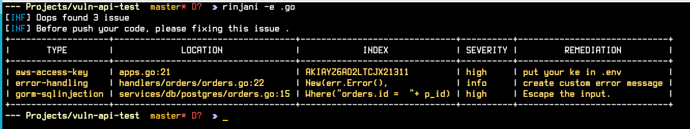
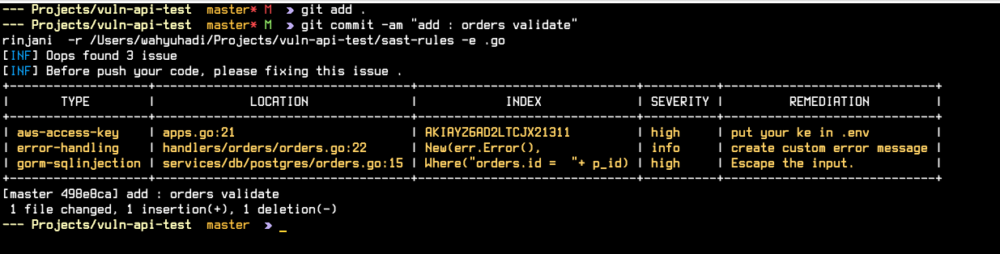
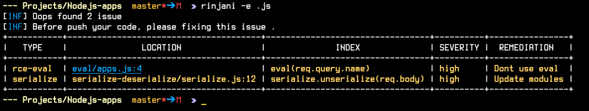

<!-- ABOUT THE PROJECT -->
## About The Project

Static application security testing (SAST) software inspects and analyzes an application’s code to discover security vulnerabilities without actually executing code.  SAST tools provide vulnerability information and remediation suggestions for development teams to resolve. There is relation and overlap between SAST tools and software, but SAST products are more focused on security testing. Static code analysis products, on the other hand, combine a number of analytical practices, test management, and team collaboration features.

Here's why:
* Create your own rules on yours framework
* Run in all language depends on your rules


<!-- GETTING STARTED -->
## Getting Started

This is an example of how you may give instructions on setting up your project locally.
To get a local copy up and running follow these simple example steps.

### Prerequisites

This is an example of how to list things you need to use the software and how to install them.
* Create folder with name sast-rules in yours projects
  ```sh
  mkdir sast-rules
  ```
 * Create your own rules with .yaml example example gorm.yaml
	  ````
		id: gorm-sqlinjection
		info:
			name: Gorm SQL Injection
			author: wahyuhadi
			severity: high
			details: SQL-Injection
			impact: Take Over database
			remediation: Escape the input. or read idomatic
		file:
			indexwith:
				- type: regex
				regex:
					- '(?i)where\(.*\+.*\)'
				- type: regex
				regex:
					- '(?i)and.+=%s|(?i)or.+=%s|(?i)where.+=%s'
				- type: regex
				regex:
					- 'Find\(.*\,.*\)|First\(.*\,.*\)'
	````
	


### Installation


1. Clone the repo
   ```sh
   git clone https://github.com/wahyuhadi/rinjani.git
   ```
2. Run Unitest and install
   ```sh
   make test
   make install
   ```
3. How to run 
by default rinjani use sast-rules folder
   ```sh
   rinjani -e .go
   ```
   or
    ```sh
   rinjani -r /<your rule location> -e .go
   ```
	or  add in your git hook before commit
	```sh
	vim .git/hooks/pre-commit
	```
    this code to pre-commit and git permission chmod  755 .git/hooks/pre-commit
	```
	rinjani -e .go
	```

### Installation with docker
```sh
   docker pull wahyuhadi/rinjani
```


<!-- USAGE EXAMPLES -->
## PoC
* run manual 

* with hooks pre-commit

* Testing in Nodejs


<!-- LICENSE -->
## License

Distributed under the MIT License. See `LICENSE` for more information.


